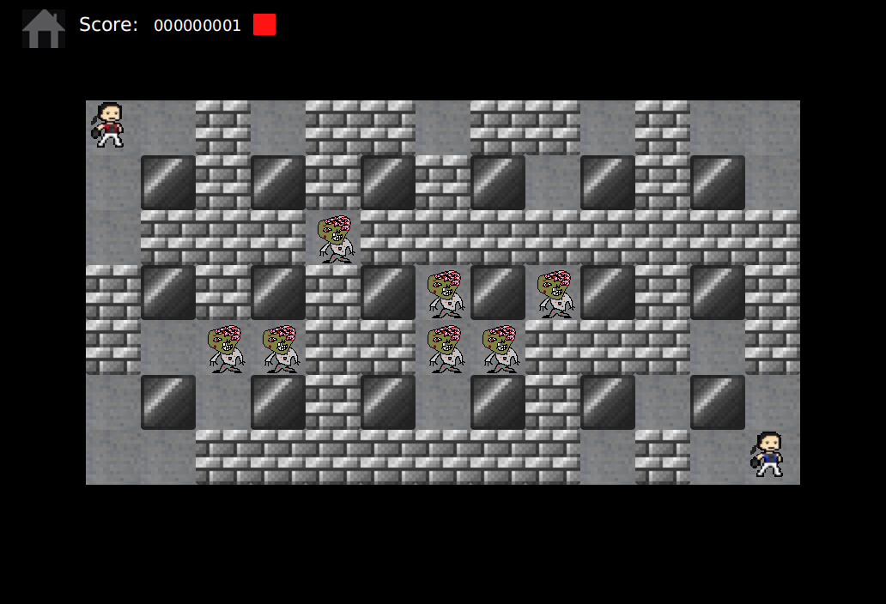

# CSE 101 Project
My first game developed for CSE101 course.

It is simple Bomberman game. 

## Usage
1. Build JAR with Maven
   ```bash
    mvn clean package
   ```
2. Execute build jar with
    ```bash
    java -jar bomber-mulayim-1.0.00.jar 
    ```

## Some Screenshots

<details>

<summary>MainMenu.png</summary>


</details>

<details>

<summary>GamePlayMenu.png</summary>



</details>

<details>

<summary>GameOverDialog.png</summary>


</details>
